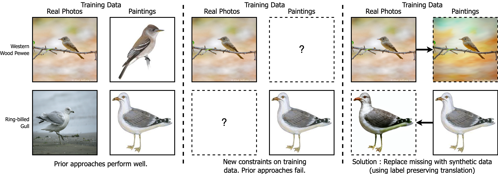

# SynCDR : Training Cross Domain Retrieval Models with Synthetic Data

Welcome to the official implementation of our paper [SynCDR : Training Cross Domain Retrieval Models with Synthetic Data](https://arxiv.org/abs/2401.00420). 




In cross-domain retrieval, a model is required to identify images from the same semantic category across two visual domains. For instance, given a sketch of an object, a model needs to retrieve a real image of it from an online store's catalog. A standard approach for such a problem is learning a feature space of images where Euclidean distances reflect similarity. Even without human annotations, which may be expensive to acquire, prior methods function reasonably well using unlabeled images for training. Our problem constraint takes this further to scenarios where the two domains do not necessarily share any common categories in training data. This can occur when the two domains in question come from different versions of some biometric sensor recording identities of different people. We posit a simple solution, which is to generate synthetic data to fill in these missing category examples across domains. This, we do via category preserving translation of images from one visual domain to another. We compare approaches specifically trained for this translation for a pair of domains, as well as those that can use large-scale pre-trained text-to-image diffusion models via prompts.

If you find this paper/repository useful for your work, please consider citing : 

```bibtex
@article{mishra2023syncdr,
  title={SynCDR: Training Cross Domain Retrieval Models with Synthetic Data},
  author={Mishra, Samarth and Castillo, Carlos and Wang, Hongcheng and Saenko, Kate and Saligrama, Venkatesh},
  journal={arXiv preprint arXiv:2401.00420},
  year={2023}
}
```

### Synthetic Data Generation

This repository supports generating synthetic data using 4 different methods as reported in the paper:

- Constrastive Unpaired Translation : Code and README under `CUT/`
- Img2Img/SDEdit : Code and README under `diffusers_generation/`
- InstructPix2Pix : Code and README under `diffusers_generation/`
- ELITE : Code and README under `ELITE/`

### Training and Evaluation of SynCDR

All code and instructions for training SynCDR are under `SynCDR/`.

